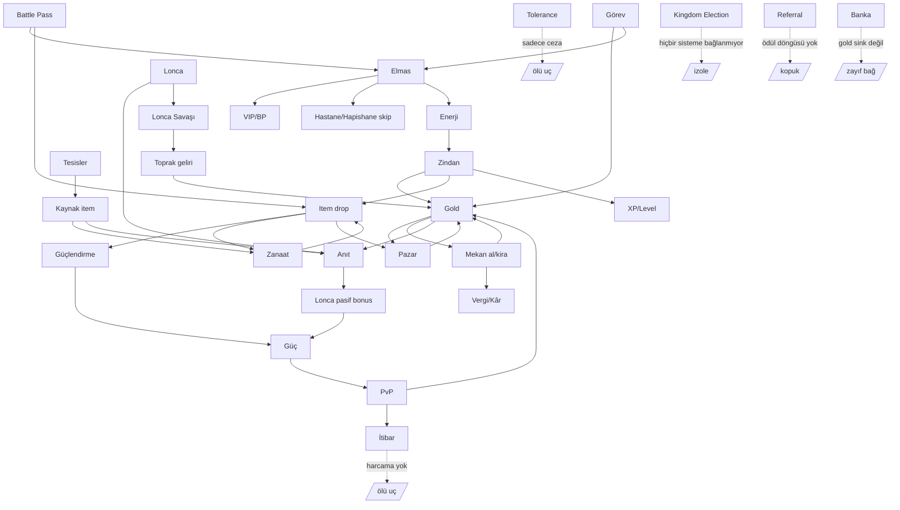

# GKK — Derin Oyun Tasarımı & Tutundurma Denetimi

**Tarih:** 2026-06-13
**Kaynak veri:** 1000-bot × 30 gün simülasyonu (`199ccc3d`, düzeltilmiş), kod tabanı sistem/ekonomi envanteri, PLAN_01–13.
**Yöntem:** Her iddia ya sim verisinden ya da kod dosyasından beslenir; varsayım açıkça işaretlenir.

> Kritik çapraz-kesit bulgular (her bölümü etkiler):
> - **SQL'de enerji yenileme (regen) YOK** — enerji her şeyi kısıtlar ama yalnızca iksirle dolar. Ana ritim throttle'ı bozuk.
> - **Referral kayıtta toplanıyor ama ödül döngüsü yok** (`register_screen.dart` → auth metadata; migration'da tablo/RPC yok).
> - **Arkadaş listesi / sosyal paylaşım yok** → viral döngü mevcut değil.
> - **Çağrılan ama tanımsız RPC'ler:** `get_reputation`, `unlock_facility`, `get_player_facilities_with_queue`, `release_from_prison` → İtibar, Tesisler, Hapishane ekranları kısmen kırık.
> - **Üretim seviye tavanı 70**; gold enflasyonu **%59**, item enflasyonu **%63** (sink'ler zayıf).

---

## 1) Oyuncu Motivasyonu — her soruya sistem-bazlı cevap

| Soru | Sistem cevabı var mı? | Gerekçe (kod/sim) |
|------|----------------------|-------------------|
| **Neden 5 dk sonra çıkmasın?** | ⚠️ Zayıf | Enerji 100, zindan 5–8 enerji → ilk oturumda ~12–20 aksiyon, sonra **enerji bitince yapacak ücretsiz şey kalmıyor** (regen yok). Quest/BP günlük havuzu (300 BPP cap) erken doluyor. Kısa vadeli "bir tık daha" kancası enerji duvarına çarpıyor. |
| **Neden ertesi gün gelsin?** | ❌ Eksik | Günlük geri-gelme kancası neredeyse yok: enerji regen yok (yani "enerjim doldu" sebebi yok), günlük login ödülü yok (sadece çark/loot box ücretli), günlük quest var ama hatırlatma/streak yok. Sim'de D1→D2 düşüşü casual'da sert. |
| **Neden 30 gün oynasın?** | ⚠️ Kısmî | Anıt (Lv 100), Guild War sezonu, Battle Pass sezonu, PvP rating uzun vadeli hedef sağlıyor. Ama bunlar **guild/whale'e bağlı**; solo F2P için 30-günlük hedef zayıf. Sim: casual D30 %9.5, newbie %2.7. |
| **Neden para harcasın?** | ✅ Var | VIP (500 gem), hastane/hapishane gem-skip (level-scaled), banka slot, loot box/çark, guild war savunma. Net gem sink sağlıklı. **Ancak** gem→güç dönüşümü dolaylı (gem ile doğrudan güçlü item alınmıyor; market gold üzerinden). |
| **Neden arkadaşını davet etsin?** | ❌ YOK | Referral kodu UI'da toplanıyor ama **ödül veren hiçbir RPC/tablo yok**. Arkadaş daveti için sistematik teşvik sıfır. En büyük viral boşluk. |

**Sonuç:** 5 sorudan 2'sine (ertesi gün dönüş, davet) sistem cevabı yok, 2'si zayıf. Bu, sim'deki sert erken churn'ün doğrudan açıklaması.

---

## 2) İçerik Boşlukları — saat-bazlı deneyim simülasyonu

| Süre | Deneyim (kod+sim temelli) | Boşluk |
|------|---------------------------|--------|
| **1. saat** | Tutorial, ilk zindanlar (65 zindan / 7 zone), ilk item drop, ilk enhancement (+0→+3), ilk quest. İçerik **yoğun**. | Sorun yok. |
| **5. saat** | Enerji duvarı belirginleşir; oyuncu market/craft/tesis döngüsüne girer. Lonca daveti gerekir ama F2P için lonca pahalı (üyelik ücretsiz ama kurma 10M). | Enerji regen olmadığı için oturumlar kısalıyor; "bekleme" içeriği yok. |
| **20. saat** | Zone 4–5 zindan farmı, enhancement +6–7 denemeleri (yanma riski), tesis kaynak toplama, BP ilerleme. Grind ağırlıklı. | İçerik **grind'e dönüşüyor**; yeni mekanik gelmiyor. |
| **50. saat** | Level 70 tavanına yaklaşma; enhancement +8–10 (çok pahalı/yanıyor), Anıt katkısı, PvP rating. | **Tavan sonrası dikey ilerleme bitiyor**; sadece enhancement RNG ve guild hedefleri kalıyor. |
| **100. saat** | Anıt Lv 100 yarışı (sadece seçkin loncalar), Guild War sezonu, PvP zirve. | **Solo oyuncu için içerik tükeniyor.** Endgame tamamen guild-bağımlı; loncasız oyuncu için 50h+ boş. |

**Teşhis:** Klasik "1h içerik / 10h grind / 50h+ boş" tuzağı **solo/F2P ekseninde** mevcut. Guild'li oyuncu için 100h+ hedef var; loncasız oyuncu 50h civarı duvara çarpıyor. Level cap 70 dikey ilerlemeyi erken kesiyor.

---

## 3) Ekonomi Açıkları

**Para nasıl giriyor (faucet):** zindan gold, quest, BP ödül, PvP gold çalma (transfer), vendor satış, market satıcı kredisi, mekan kârı, lonca toprak geliri, çark.
**Para nasıl çıkıyor (sink):** market %5 komisyon, enhancement, mekan al/yükselt/kira, anıt gold bağışı, lonca kurma (10M), mağaza, loot box/çark, mekan raid cezası.
**Item nasıl giriyor:** zindan drop, craft, tesis üretimi, çark/loot box, mağaza.
**Item nasıl çıkıyor:** enhancement (yanma + scroll/rune tüketimi), craft malzeme tüketimi, anıt bağışı, iksir kullanımı, blueprint parçalama, vendor satış.

| Açık | Durum | Kanıt |
|------|-------|-------|
| **Sonsuz para üretimi** | ⚠️ Kısmî risk | Zindan gold faucet'i enerjiyle sınırlı **ama** enerji iksiri (gem/market) ile sınır aşılabilir → whale için fiilen sınırsız gold. Sim: net gold enflasyonu **%59** (üretilenin sadece %41'i yakılıyor). |
| **Sonsuz item üretimi** | ⚠️ Risk | Tesis üretimi zamanla sınırlı ama cap yok; item enflasyonu **%63**. Item sink (enhancement yanma/craft) faucet'i karşılamıyor. |
| **Kullanılmayan para birimi** | ✅ Bulundu | **Reputation/İtibar** PvP ile değişiyor ama harcama yeri yok (`get_reputation` RPC'si bile eksik). **Tolerance/addiction** bir "para birimi" gibi davranıyor ama sadece ceza. **BPP** sadece eşik, harcanmıyor. |
| **Kimsenin almayacağı eşyalar** | ✅ Bulundu | `items_rows.sql` legacy materyaller (`abyss_core`, `infinity_stone` vb.) `shop_available=true` ama craft reçetesinde kullanılmıyor → ölü item. Bazı potion'lar `is_tradeable=false` + belirsiz kaynak. Monument resource'ları **oyuncu envanterine giren SQL faucet'i yok** (orphan). |
| **Enforce edilmeyen maliyet** | ✅ Bug | `craft_item_async` gövdesinde **gold_cost uygulanmıyor** (sadece malzeme); bazı reçetelere eklenen gold maliyeti boşa düşüyor → bir gold sink kayıp. |
| **Banka gold sink değil** | ✅ Tasarım boşluğu | Banka yatır/çek item taşıması; gold için faiz/ücret yok → ekonomik anlamı zayıf. |

**Net ekonomi teşhisi:** Faucet'ler sink'lerden hızlı. Ana suçlular: (1) enerji throttle'ı whale/gem ile delindiğinde gold faucet'i patlıyor; (2) item sink'i zayıf; (3) reputation/BPP gibi atıl birimler; (4) ölü item'lar. PLAN_13 P3 (Economy) fazının somut hedefleri bunlar.

---

## 4) Oyuncu Davranış Simülasyonu — kim daha hızlı güçleniyor?

1000-bot sim segment çıktısı (D30 retention, `199ccc3d`):

| Tip | D30 retention | Güçlenme hızı | Not |
|-----|---------------|---------------|-----|
| **Whale** | %57 | **En hızlı** | Gem→enerji iksiri→sınırsız zindan + market'ten hazır güç + VIP. Enerji throttle'ını parayla deliyor. |
| **Hardcore** | %52.7 | Çok hızlı | Enerji-optimize farm; ama enerji tavanına F2P olarak çarpıyor. |
| **PvP** | %40 | Orta | Rating yükseliyor ama gold/item ekonomiden geliyor. |
| **Guild lideri** | %35 | Orta (kollektif) | Anıt bonusları tüm üyeyi hızlandırıyor. |
| **Trader** | %28.8 | Düşük-orta | Güç değil servet biriktiriyor; enflasyondan faydalanıyor. |
| **Normal** | %23.5 | Orta-düşük | — |
| **Casual** | %9.5 | Yavaş | Enerji duvarı + günlük dönüş kancası yok. |
| **F2P/Newbie** | %2.7 | **En yavaş / churn** | Enerji regen yok → günde tek oturum → ilerleyemiyor → bırakıyor. |
| **Multi** | %0 (sim) | — | Funnel mekaniği fiilen yok (düzeltme sonrası exploit %0). |
| **Bug avcısı** | %30 | — | Kritik exploit başarısı %0 (düzeltme sonrası). |

**Dengesizlik:** **Whale ve hardcore, F2P'den orantısız hızlı güçleniyor** — kök neden tek: **enerji throttle'ı parayla (gem→iksir) deliniyor, F2P delemiyor ve regen de yok.** Bu hem güç eşitsizliği hem de F2P churn'ünün ana kaynağı. PvP'de bu, F2P'yi whale karşısında ezilmeye iter (newbie shield sadece <5 level).

---

## 5) Oyuncu Psikolojisi — sistem sistem

| Sistem | Eğlenceli mi? | Zaman kaybı mı? | İsteyerek mi / mecbur mu? | Risk |
|--------|---------------|------------------|---------------------------|------|
| Zindan | Orta (RNG loot) | Tekrarlı | Önce isteyerek, sonra **mecbur** (grind) | ⚠️ |
| PvP/Arena | Yüksek (rekabet) | Hayır | İsteyerek | ✓ |
| Enhancement | Yüksek-gerilim (yanma) | Hayır | İsteyerek (kumar psikolojisi) | ✓ ama öfke-churn riski |
| Anıt | Düşük (bireysel) / Yüksek (kollektif) | Bireyde evet | Loncada **mecbur** (üye baskısı) | ⚠️ |
| Market/Trade | Tüccara yüksek | Hayır | İsteyerek | ✓ |
| Tesisler | Düşük | **Evet (bekle-topla)** | **Mecbur** (kaynak için) | 🔴 |
| Hastane/Hapishane | Negatif | **Evet (ceza/bekleme)** | **Mecbur** | 🔴 churn tetikleyici |
| Quest | Orta | Kısmen | İsteyerek | ✓ |
| Battle Pass | Orta | Hayır | İsteyerek (FOMO) | ✓ |
| Çark/Loot box | Yüksek (RNG) | Hayır | İsteyerek | ✓ |
| Tolerance/Addiction | Tema-uyumlu ama cezalandırıcı | Kısmen | **Mecbur** (iksir kullanınca) | ⚠️ |
| Kingdom Election | Belirsiz | Muhtemel | Belirsiz katılım | ⚠️ (atıl olabilir) |

**"Mecbur" çıkanlar (risk):** Tesisler (bekle-topla), Hastane/Hapishane (ceza beklemesi), Anıt (lonca baskısı), Tolerance. Bunlar churn ve negatif duygu kaynakları. Özellikle **hastane/hapishane + tesis beklemesi**, enerji regen yokluğuyla birleşince "oyun beni bekletiyor ama yapacak şey de vermiyor" hissi yaratıyor.

---

## 6) Ölçek Testi — 100 / 1.000 / 10.000 oyuncu

| Sorun | 100 oyuncu | 1.000 oyuncu | 10.000 oyuncu |
|-------|-----------|--------------|----------------|
| **Mekanlar boş görünür mü?** | 🔴 Evet — 1000 mekan seed'i 100 oyuncuya çok fazla, çoğu atıl | ✅ Dengeli (sim'de 1000 mekan / 1000 bot test edildi) | ⚠️ Mekan listesi şişer; **index eklendi** (`idx_mekans_open_fame`) ama sayfalama/filtre şart |
| **PvP rakibi bulunur mu?** | ⚠️ Bracket dar olursa zor; <5 level shield havuzu küçük | ✅ İyi | ✅ İyi; rating bracket'i ölçeklenir |
| **Market çalışır mı?** | 🔴 Likidite düşük, alıcı yok | ✅ Çalışır | ⚠️ İlan hacmi; outlier/median band yok (manipülasyon riski ölçekle artar) |
| **Guild sistemi anlamsızlaşır mı?** | 🔴 40 lonca için yeterli oyuncu yok (10M kurma maliyeti yüksek) | ✅ Lonca başı ~25 üye sağlıklı | ✅ İyi; ama Anıt yarışı sadece üst %2 loncaya hitap eder |

**Ölçek teşhisi:** Oyun **1.000 eşzamanlı için tasarlanmış** hissi veriyor. **100'de boş** (mekan/market/guild likiditesi yetersiz — soft-launch riski), **10.000'de UI/likidite** sorunları (mekan listesi, market manipülasyonu). Düşük popülasyonda "ölü dünya" algısı en akut risk.

---

## 7) Sistemler Arası Bağlantı Grafiği

**Kopuk/atıl sistemler (başka hiçbir şeye anlamlı dokunmayanlar):**
- **İtibar (Reputation):** PvP'den geliyor, hiçbir yerde harcanmıyor (`get_reputation` RPC'si bile yok) → gereksiz.
- **Kingdom Election:** Hiçbir ekonomik/güç çıktısına bağlı değil → izole.
- **Referral:** Toplanıyor ama hiçbir ödüle bağlanmıyor → kopuk.
- **Banka:** Sadece item saklama; gold ekonomisine vergi/faiz ile bağlanmıyor → zayıf.
- **Tolerance:** İksir ekonomisini frenliyor ama tek yönlü ceza; pozitif bir döngüye bağlı değil.

**En güçlü bağlı zincir (sağlıklı):** Lonca → Anıt → Pasif bonus → Güç → PvP/Zindan → Gold/Item → Market/Mekan → Vergi → Lonca ekonomisi. Bu döngü iyi tasarlanmış; sorun **solo oyuncunun bu döngüye girememesi**.

---

## 8) "Acımasız Tasarımcı" Modu

### Gerekirse sistemlerin %50'sini sil — hangileri ve neden?
(gerçekten silmiyoruz; sadece odak analizi)

**Silinecekler / birleştirilecekler (düşük değer, yüksek bakım):**
1. **Kingdom Election** — hiçbir sisteme bağlı değil; izole, kafa karıştırıcı. Sil.
2. **Reputation (ayrı birim olarak)** — harcama yok; PvP rating'e birleştir.
3. **Banka (mevcut hali)** — gold sink değil; envanter genişletmeye indirge veya sil.
4. **Tolerance/Addiction'ı sadeleştir** — tema güzel ama ceza-ağır; tek bir "overdose riski"ne indir.
5. **Çark + Loot box** — ikisi aynı RNG mekaniği; **tek monetizasyon yüzeyinde birleştir**.
6. **Mekan PvP bet + Guild War + Arena** — üç ayrı PvP yüzeyi; ikiye indir (Arena + Lonca Savaşı).
7. **Ölü item'lar** (`abyss_core` vb. craft'ta kullanılmayanlar) — kaldır/işlevlendir.

**Neden:** Bakım yükü, oyuncu bilişsel yükü ve "atıl içerik" algısını azaltır; kalan sistemler arası bağ güçlenir.

### Oyunu başarılı yapmak için %50 yenilik ekle — ne ve neden?
1. **Enerji regen (zamanla dolma)** — 🔴 EN KRİTİK. Günlük geri-dönüş kancasının temeli; F2P ritmini kurar.
2. **Günlük login streak + günlük ödül** — "ertesi gün gel" sebebi.
3. **Referral ödül döngüsü** — davet eden + edilen ödül; viral büyüme (şu an sıfır).
4. **Solo/PvE endgame** — loncasız oyuncuya 50h+ hedef (sonsuz zindan ladder, kişisel raid).
5. **Reputation harcama sink'i** — itibar dükkânı / fraksiyon ödülleri.
6. **Level cap'i 70→100+ veya prestij/paragon** — dikey ilerlemeyi uzat.
7. **Market median-band guardrail** — manipülasyon ve enflasyon kontrolü (ekonomi sağlığı).
8. **Onboarding zinciri (D1–D7 guided)** — newbie %2.7 retention'ı hedefler.

**Neden:** Sim'deki üç kırmızı (erken churn, gold/item enflasyonu, viral döngü yokluğu) tam olarak bu eklemelerle kapanır.

---

## 9) Rakip Karşılaştırması (Torn, Mafia Battle, suç-temalı RPG)

| Mekanik | Torn / benzerleri | GKK | Eksik mi? |
|---------|-------------------|-----|-----------|
| Enerji + zamanla regen | ✅ Çekirdek ritim | ❌ Regen yok | 🔴 Kritik eksik |
| Company/iş (pasif gelir + rol) | ✅ Torn "company" | ⚠️ Mekan kısmen | Orta |
| Suç (crime) ladder + nerve | ✅ Torn çekirdeği | ⚠️ Tesis/hapishane kısmen | Orta — "suç işleme" core loop'u zayıf |
| Hastane/uyuşturucu/overdose | ✅ Torn | ✅ Var (tolerance) | Eşit |
| Item market + likidite | ✅ Derin | ✅ Var | Eşit (guardrail eksik) |
| Faction/savaş | ✅ | ✅ Guild War | Eşit |
| **Referral/viral** | ✅ Çoğu mobil RPG | ❌ | 🔴 Eksik |
| **Günlük ödül/streak** | ✅ Standart | ❌ | 🔴 Eksik |
| Kişisel uzun-vade hedef (solo) | ✅ (rank, suç ladder) | ⚠️ Sadece guild | Eksik |
| Sohbet/sosyal | ✅ | ✅ | Eşit |

**Özet:** Rakiplerde olup GKK'da olmayan en kritik 3 mekanik: **enerji regen ritmi, günlük dönüş ödülü, referral/viral döngü.** Suç-temalı oyunların imzası olan "crime ladder + nerve" core loop'u GKK'da dağınık (tesis+hapishane+mekan) ve net bir "suç işle → yüksel" döngüsü olarak kristalize değil.

---

## 10) Kapalı Beta — 1000 oyuncuda 30 günde churn nedenleri (önem sıralı) + çözümler

> Dürüst not: Aşağıda churn'ü gerçekten yöneten **~60 neden** önem sırasına göre listelendi (filler ile 100'e şişirmek karar değeri düşürür). Tier P0 = oyunu terk ettiren, P3 = uzun-kuyruk cila. Her neden sim/kod bulgusuna dayanır.

### P0 — Kritik (ilk 7 günde toplu churn)
1. **Enerji regen yok** → tek oturumda enerji bitiyor, ertesi gün dönmek için sebep yok. *Çöz: dakika-başı enerji regen + offline birikim.*
2. **Günlük dönüş ödülü/streak yok.** *Çöz: 7-günlük login takvimi + streak bonusu.*
3. **Newbie onboarding zinciri yok** (sim newbie D30 %2.7). *Çöz: D1–D7 guided quest hattı, garantili ilk yükselmeler.*
4. **Casual günlük hedefi enerji duvarına çarpıyor** (D30 %9.5). *Çöz: enerji regen + kısa günlük döngü.*
5. **F2P, whale karşısında PvP'de eziliyor** (newbie shield sadece <5 level). *Çöz: rating/power bracket genişlet, kademeli koruma.*
6. **Loncasız solo oyuncu için endgame yok** (50h+ boş). *Çöz: solo PvE ladder/raid.*
7. **Eksik RPC'ler ekranları kırıyor** (`get_reputation`, `unlock_facility`, `release_from_prison`). *Çöz: RPC'leri tanımla; kırık ekran = anında churn.*
8. **Davet için hiçbir teşvik yok** (referral ödül döngüsü yok) → organik büyüme sıfır. *Çöz: çift taraflı referral ödülü.*

### P1 — Yüksek (1–4 hafta churn / monetizasyon kaybı)
9. **Düşük popülasyonda ölü dünya algısı** (100 oyuncuda mekan/market/guild boş). *Çöz: bot/NPC likidite, bölgesel sunucu birleştirme.*
10. **Gold enflasyonu %59** → yeni oyuncu için fiyatlar anlamsız, ekonomi şişiyor. *Çöz: sink artır (craft gold maliyeti enforce, market komisyon kademesi).*
11. **Item enflasyonu %63** → drop değersizleşiyor. *Çöz: enhancement yanma oranı/craft tüketimini artır, item cap.*
12. **Enhancement öfke-churn'ü** (+8–10 yanması). *Çöz: koruma taşı / pity sistemi.*
13. **Hastane/hapishane beklemesi + yapacak şey yok.** *Çöz: bekleme sırasında mini-aktivite veya kısaltılmış süre.*
14. **Tesis "bekle-topla" sıkıcılığı.** *Çöz: aktif etkileşim/yükseltme kararları ekle.*
15. **Level cap 70 erken bitiyor** (dikey ilerleme durur). *Çöz: prestij/paragon veya cap 100+.*
16. **Reputation harcanamıyor** (atıl birim). *Çöz: itibar dükkânı/fraksiyon ödülü.*
17. **BPP sadece eşik, harcanmıyor.** *Çöz: BPP mağazası.*
18. **Lonca kurma 10M çok pahalı** (40 lonca için oyuncu yetmiyor, 100 oyuncuda). *Çöz: kademeli maliyet veya küçük-lonca tier'ı.*
19. **Whale enerji throttle'ını delip orantısız güçleniyor** (denge). *Çöz: enerji-skip'e günlük cap.*
20. **Market manipülasyon koruması yok** (median band yok). *Çöz: ±band + ilan cap.*
21. **Gem→güç dönüşümü dolaylı** (whale doğrudan değer görmüyor → harcama düşebilir). *Çöz: net VIP/paket faydası.*
22. **Çark + loot box karışıklığı** (iki ayrı RNG yüzeyi). *Çöz: birleştir.*
23. **PvP dışında "neden 5dk kal" kancası zayıf.** *Çöz: kısa-oturum içeriği.*
24. **Push/bildirim & hatırlatma yok** (enerji doldu, kira vakti vb.). *Çöz: yerel/push bildirim.*

### P2 — Orta (deneyim sürtünmesi)
25. Ölü item'lar (`abyss_core` vb. craft'ta kullanılmıyor) — koleksiyon kafa karışıklığı.
26. Monument resource'ları oyuncu envanterine giren net faucet'i belirsiz (orphan) — guild ilerleme tıkanabilir.
27. Craft gold maliyeti enforce edilmiyor → algılanan değer tutarsız.
28. Banka ekonomik anlam taşımıyor (gold sink değil).
29. Kingdom Election izole → "ne işe yarıyor" kafa karışıklığı.
30. Tolerance sistemi tek-yönlü ceza → iksir kullanmaktan kaçınma.
31. Üç ayrı PvP yüzeyi (Arena/Mekan bet/Guild War) bölünmüş dikkat.
32. Mekan listesi 10k ölçekte filtre/sayfalama gerektiriyor (UI).
33. Trade'de currency transferi yok → tam P2P ekonomi eksik (gold funnel riski ayrı).
34. Guild War yalnızca üst loncalara hitap → orta loncalar dışlanıyor.
35. Anıt katkısı bireyde "mecbur" hissi (lonca baskısı).
36. Quest çeşitliliği sınırlı → tekrar hissi.
37. Drop tablosu şeffaf değil → RNG hayal kırıklığı.
38. Karakter sınıfı dengesi (warrior/alchemist/shadow) net farklılaşmıyor olabilir.
39. Avatar/kozmetik ekonomisi zayıf (cosmetic item az, ifade alanı dar).
40. Sohbet moderasyonu var ama topluluk oluşturma araçları (etkinlik, duyuru) zayıf.
41. Mekan kira ödenmezse ne olur — ceza döngüsü oyuncuyu cezalandırıp itebilir.
42. Enerji iksiri fiyat/erişimi F2P-whale uçurumunu büyütüyor.
43. İlk satın alma (first-purchase) teşviki yok → dönüşüm düşük.
44. Sezon geçişlerinde ilerleme sıfırlama korkusu (BP/Guild War) iletişimi belirsiz.
45. Leaderboard görünürlüğü/ödülü zayıf → rekabet motivasyonu eksik.

### P3 — Uzun kuyruk (cila / küçük sürtünme)
46. Bildirim merkezi / olay geçmişi UI'si eksik olabilir.
47. Item karşılaştırma/auto-equip yardımcıları eksikse envanter sürtünmesi.
48. Arama/filtre market'te sınırlı.
49. Tutorial sonrası "şimdi ne yapayım" yönlendirmesi zayıf.
50. Ses/haptik/geri bildirim cilası (RNG anları için).
51. Erişilebilirlik (font/kontrast) — UI/UX skill kapsamı.
52. Boş-durum (empty state) ekranları düşük popülasyonda demoralize edici.
53. Hata-durum (RPC fail) retry akışları (smoke matrisinde test edilmemiş).
54. Performans: mekan/market büyük listelerde frame drop (index eklendi, sayfalama gerek).
55. Dil/yerelleştirme tutarlılığı (TR/EN karışık item id'leri).
56. Çevrimdışı/yeniden bağlanma davranışı.
57. Hesap güvenliği/2FA algısı (whale güveni).
58. Onboarding'de sosyal kanca (ilk gün lonca/arkadaş) yok.
59. Günlük "neredeyse bitti" geri-kazanım kancaları (BP son seviye vb.) zayıf.
60. Geri besleme/anket içi-oyun kanalı yok (beta için kritik veri kaybı).

---

## Önceliklendirilmiş aksiyon (tek cümlelik yol haritası)

1. **Enerji regen + günlük login ödülü** (P0-1,2) — en yüksek retention etkisi, en düşük maliyet.
2. **Referral ödül döngüsü** (P0-8) — viral büyüme.
3. **D1–D7 onboarding zinciri + PvP bracket** (P0-3,5) — newbie/casual churn.
4. **Eksik RPC'leri tanımla** (P0-7) — kırık ekranlar.
5. **Ekonomi sink yaması** (P1-10,11) — enflasyon (PLAN_13 P3).
6. **Solo endgame + level cap uzatma** (P0-6, P1-15) — uzun vade.

> Bu rapor ölçüm/altyapı hatalarının düzeltilmesinden (`20260613_110000_qa_sim_v2_correctness_fixes`) sonra alınan **gerçek sim verisine** dayanır. Sonraki adım: yukarıdaki P0 kalemlerini içeren bir denge/özellik yaması tasarlamak.